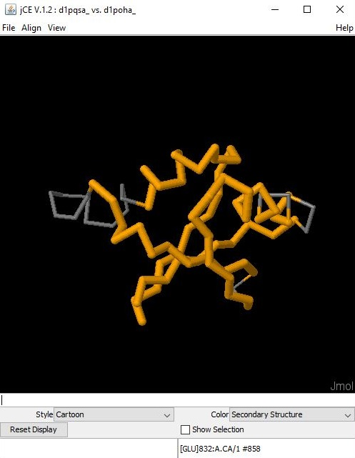
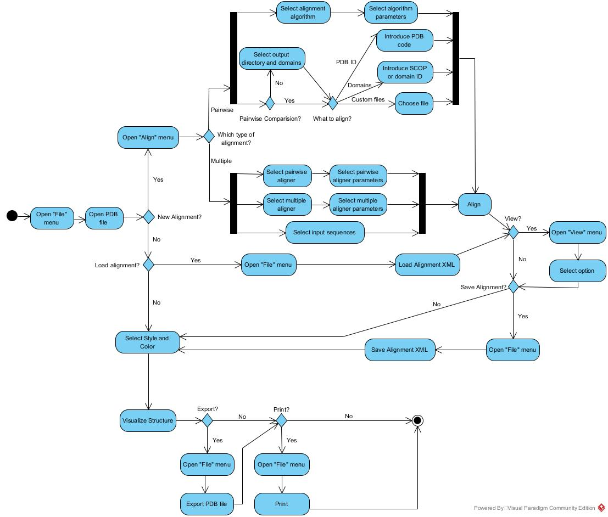

##Process View

Since BioJava is a framework, there are some demos available to illustrate the usage of the tools it provides. Among all the modules of Biojava, the structure module is the only one with a graphical user interface. Thus, by running the demos for that module it was possible to understand how the interface works. The GUI has 3 menus - "File", "Align" and "View" -, a 3D visualization of the structure and some options:

The "File" menu allows to open or export a PDB file, load or save an Alignment XML and Print. So first, it is necessary to open a protein structure through a PDB file. Then, the user can simply visualize the structure and select a color and style for the representation or perform a new alignment. As the "View" menu allows to check some results of the alignment, it is expected that an alignment will be performed (or loaded) first. An alignment (multiple or pairwise) can be performed through the "Align" menu. The flow of operations is described on the following activity diagram:

